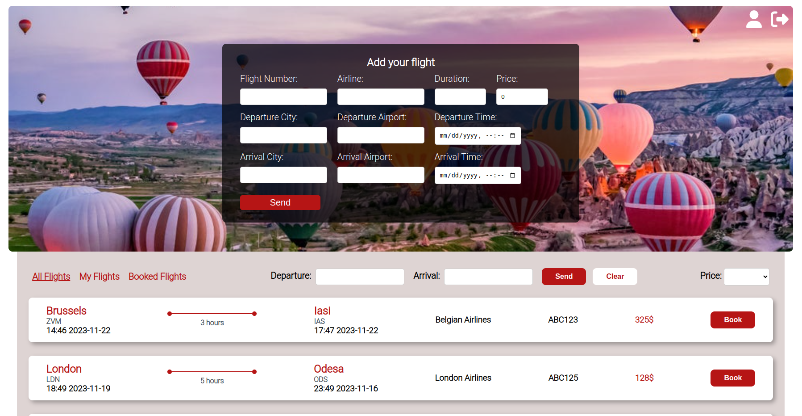

# Flights App - MERN Fullstack Project

Welcome to the Flights app, where your journey begins! This MERN full-stack application is designed for exploring, managing, and booking flights. Below is an overview of the project's features and technologies.

## Screenshots

## Project Overview

### Introduction

The Flights app is an app for discovering, managing, and booking flights. This platform offers a user-friendly space for flight-related needs.

### Features

- **Explore Flights:** view a list of available flights.
- **Register and Log In:** create an account or log in for a personalized experience.
- **Add Your Flights:** users can add their flights.
- **Edit and Delete:** manage and update the flights you've added in the "My Flights" section.
- **Book Flights:** the user can add the flights to the "Booked flights".
- **Unbook Flights:** Users can unbook flights they've previously booked.

### Technologies Used

The Flights app is built using the following technologies:

- Frontend: React (Vite)
- Backend: Node.js (Express)
- Database: MongoDB
- React-router-dom library
- CSS
- HTML
- axios

## Getting Started

To get started with the Flights app, follow these steps:

1. Clone the repository.

### Database
2. Create and run your Mongo server locally or in the cloud.

### Backend
3. Navigate to the folder `cd flights`, `cd server`.
4. Install the necessary dependencies `npm install`.
5. Run the application `npm run dev`.

### Frontend
6. Navigate to the folder `cd client`.
7. Install the necessary dependencies `npm install`.
8. Run the application `npm run dev`.
9. Go to `http://localhost:5173/`.

## How to Use

1. **Explore Flights:** discover a variety of flights.
2. **Create an Account:** sign up or log in for personalized features.
3. **Add Your Flights:**.
4. **Manage Flights:** edit and delete your added flights in the "My Flights" section.
5. **Book Flights:** add a flight to "Booked Flights" section and view booked flights there.
6. **Unbook Flights:** remove booked flights from your list.

## Possible Future Improvements

- Implement admin role for controlled flight addition.
- Integrate TypeScript for improved code consistency.
- Enhance user experience with Redux state management.
- Introduce purchase functionality for a seamless booking experience.

